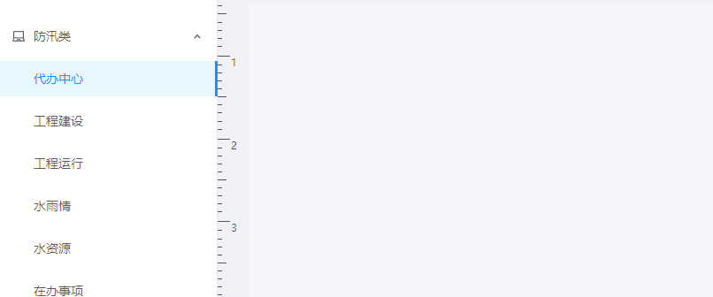

[English](./README.md) | 简体中文

# 简介

- 就像名字里写的一样，这是一个可拖拽的菜单

- 也可以像普通的Menu一样用，只要数据结构对，它可以帮你剩下排菜单结构的时间

- 基于 [antd的Menu](https://ant.design/components/menu-cn/)
  
# API  

| 名称 | 说明 | 类型 | 默认值 |
| --- | --- | --- | --- |
| selectedKeys | 当前选中的菜单项 key 数组 | [] | - |
| menuDatas | 菜单数据，对象格式见[下方](#menuDatas中的对象) | [] | - |
| openKeys | 当前展开的 SubMenu 菜单项 key 数组 | [] | - |
| onClick | 菜单项点击事件，具体可以看看 [这里](../../modules/ModuleEdit/index.js) 的 `handleMenuClick` | function (group: string, selectedKeys: string[], id: string) | - |
| onOpenChange | SubMenu 展开/关闭的回调 | function(openKeys: string[]) | - |
| shellStyleDatas | 用于控制拖拽结束时 [`Shell`](../Shell/index.js) 的样式，尚未实装 | [] | - |
| onSave | [点击左上保存时的事件](../../modules/ComponentEdit/index.js)，多用于保存右侧布局数据 | function () | - |
| type | 值为 `component` 时左上显示保存，否则跳转到 [`Display`](../../modules/Display/index.js) | string: oneOf(['component', 'module']) | - |
  
## menuDatas中的对象

| 名称 | 说明 | 类型 | 默认值 |
| --- | --- | --- | --- |
| group | 组别，用于分组 | string | - |
| groupname | 组别中文，分组后菜单项显示名称 | string | - |
| id | 菜单项唯一标识 | string or number | - |
| key | 用途暂时同id，必需 | - | - |
| order | 菜单项顺序，尚未实装 | string or number | - |
| text | 用途暂时同groupname，必需 | - | - |

# 示例

